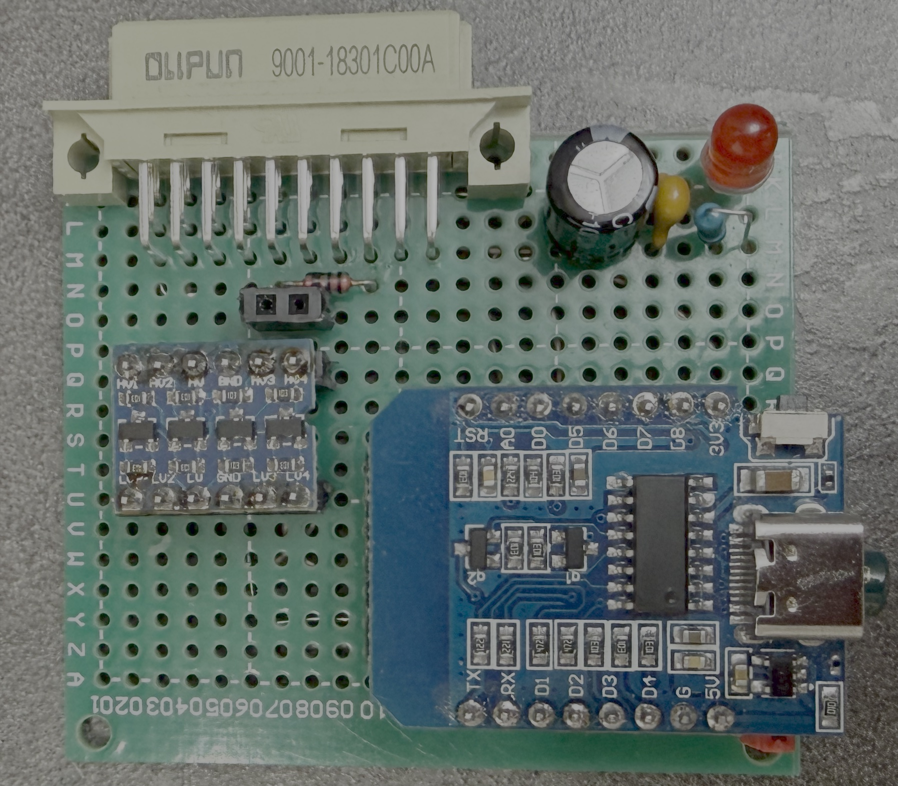
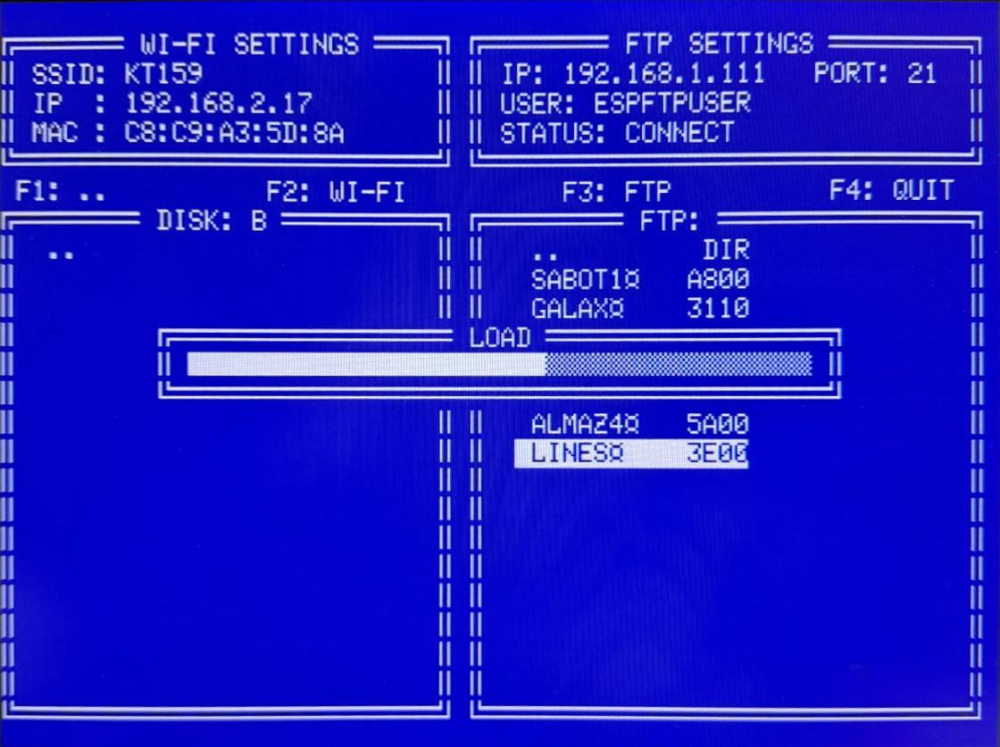
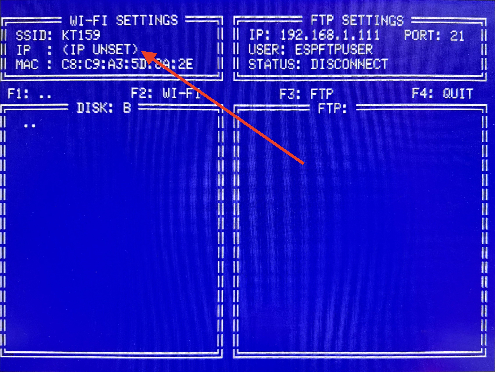
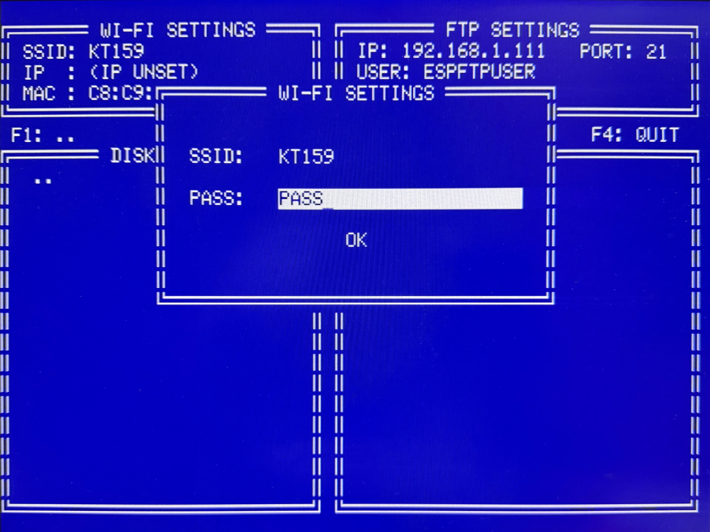

# kFTP

FTP клиент, для компьютера Орион-128.

> [!NOTE]
> Большая благодарность Алексею Морозову за компилятор с8080 (https://github.com/alemorf/c8080). Без него проект бы не состоялся!

Программа позволяет загружать файлы с FTP сервера.
Для работы программы необходиа плата с ESP12 подключенная в порт F600 (порт периферии). Введенные данные для подключения к WiFi и FTP сохраняьтся в ESP и не сбрасываются после выключения питания Орион. 

### 

### У программы есть ряд ограничений:
- Работает под ORDOS
- Пароль для WiFi должен быть только из заглавных английских букв и цифр
- Имя FTP cервера прописываеться как IP адрес.
- Пользователь и пароль для FTP сервера также как и пароль для WiFi должен содержать только заглавные английсике буквы и цифры
- Сервер FTP должен поддерживать стандарт RFC 3659, 2007

### ToDo 
- запись файла на FTP в планах.
- сделать отображение текущей папки FTP

### Схема

## Общий вид приложения

## Настройка соединения Wi-Fi
Для вызова экрана настройки WiFi нажмите F2.
Для выхода из настройки или редактирования без сохранения - нажмите "АР2(ESC)"

Если WiFi не подключен - то вместо IP отображается UNSET.

### Выбор сетей Wi-Fi
Переместите указатель на SSID и нажмите ВВОД
В открывшемся окне выберите свой SSID. (Английские буквы в названии SSID все отображаются заглавными буквами. Русские буквы исключаются из отображения)

> ВНИМАНИЕ! Для уменьшение показа доступных сетей установлен порог показа от -88 Дб.

### Ввод пароля для Wi-Fi
Перейдите на поле PASS и нажмите ВВОД.
Введите пароль для вашей сети. (Пароль должен содержать только заглавные английские буквы и цифры)
После завершения ввода нажмите ВВОД и ваш пароль сохранится.

### Подключение к Wi-Fi
Для подключения к WiFi надо нажать нажать на "OK" 
При успешном подключении в поле IP - появится IP адрес выданной сетью. 

## Настройка соединения FTP
Для вызова настройки FTP нажмите F3

### Ввод IP сервера

### Ввод порта

### Ввод имени пользователя

### Ввод пароля

## Работа с клиентом FTP

### Переключение между панелями

### Панель квази диска

### панель FTP сервера